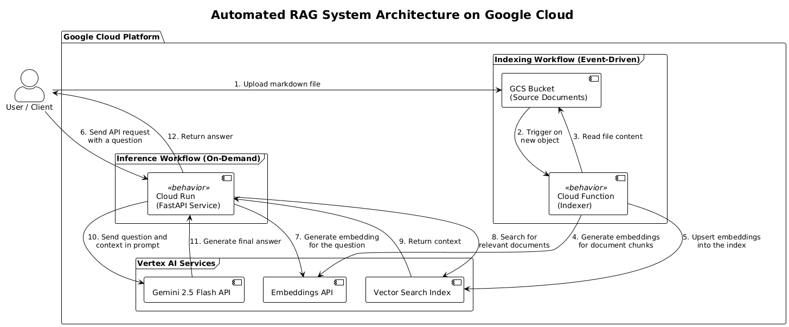

# Automated RAG System on Google Cloud

This project implements a fully automated, event-driven Retrieval-Augmented Generation (RAG) system using a serverless architecture on Google Cloud. The entire infrastructure is defined as code using Terraform.

## Project Goal

The initial goal was to build a simple RAG system. This was extended to create a robust, minimal MLOps solution that automatically updates its knowledge base. The system watches a Cloud Storage bucket for new documents, processes them, and adds them to a managed vector search index without any human intervention. This demonstrates a practical, end-to-end, cloud-native ML system.

## Architecture

The architecture is composed of two decoupled, serverless workflows:

1.  **Indexing Workflow (Event-Driven):**
    *   **GCS Bucket:** A landing zone for source markdown documents.
    *   **Cloud Functions:** Triggers automatically when a file is uploaded to the bucket. It reads the file, splits it into chunks, generates embeddings using the **Vertex AI Embeddings API**, and upserts them into the vector index.
    *   **Vertex AI Vector Search:** A scalable, fully managed vector database that stores and indexes the document embeddings for efficient, low-latency similarity searches.

2.  **Inference Workflow (On-Demand):**
    *   **Cloud Run:** A serverless container hosting a secure FastAPI application.
    *   The API endpoint takes a user query, generates an embedding for it, searches the **Vertex AI Vector Search** index for relevant context, and uses the **Gemini 2.5 Flash API** to generate a final, context-aware answer.
    *   The service is secured via IAM and accessed by authenticated users.





## Tech Stack

*   **Cloud Provider:** Google Cloud Platform (GCP)
*   **Infrastructure as Code:** Terraform
*   **Compute:** Cloud Run, Cloud Functions
*   **ML/AI Services:** Vertex AI Vector Search, Vertex AI Gemini 2.5 Flash, Vertex AI Embeddings API
*   **Storage:** Google Cloud Storage, Artifact Registry
*   **Application:** Python, FastAPI

## Setup and Deployment

This project is fully reproducible using Terraform and `gcloud`.

### Prerequisites

1.  Google Cloud SDK (`gcloud`) installed and authenticated.
2.  Terraform installed.
3.  Docker installed.
4.  A Google Cloud project with billing enabled.

### Step 1: Configure Your Environment

1.  Clone this repository.
2.  Navigate to the `terraform/` directory.
3.  Copy `terraform.tfvars.example` to `terraform.tfvars` and fill in your GCP project ID and desired region.

```hcl
# terraform/terraform.tfvars
gcp_project_id = "your-gcp-project-id"
gcp_region     = "europe-west1"
```

### Step 2: Build and Push the API Docker Image

The Cloud Run service needs a container image. Build and push the API application to Google Artifact Registry.

```bash
# Authenticate Docker with your region's registry
gcloud auth configure-docker europe-west1-docker.pkg.dev

# Get your Project ID from gcloud config
export GCP_PROJECT_ID=$(gcloud config get-value project)
export GCP_REGION="europe-west1"

# Build, tag, and push the image
docker build -t ${GCP_REGION}-docker.pkg.dev/${GCP_PROJECT_ID}/rag-api-repo/rag-api:v1 src/api
docker push ${GCP_REGION}-docker.pkg.dev/${GCP_PROJECT_ID}/rag-api-repo/rag-api:v1
```

### Step 3: Deploy the Infrastructure

Deploy all the GCP resources using Terraform.
```
cd terraform
terraform init
terraform apply
```

### Step 4: Deploy the Index to the Endpoint (One-Time Manual Step)

The infrastructure is created, but the Vector Search Index needs to be manually deployed to the Index Endpoint before it can serve traffic. Use the provided script to perform this step:

```bash
./src/api/deploy_index.sh 
```
**Note:** This deployment can take 5-15 minutes to complete.

## How to Use and Test the System

Follow these steps to deploy, populate, and test the full end-to-end RAG pipeline.

### 1. Initial Setup and Deployment

First, ensure you have completed all the steps in the **[Setup and Deployment](#setup-and-deployment)** section. This includes configuring your `terraform.tfvars`, pushing the Docker image, running `terraform apply`, and successfully deploying the index to the endpoint.

### 2. Populate the Initial Knowledge Base

Upload the sample markdown files to the `documents/` folder within the GCS bucket. This will trigger the Cloud Function for the first time. Use the provided script to upload all initial documents:

```bash
./src/indexer/upload_documents.sh
```

Wait a minute for the Cloud Function to trigger and process the files. You can monitor its progress in the Google Cloud Console by navigating to **Cloud Functions** > `rag-indexer-function` > **Logs**.

### 3. Query the Existing Knowledge

Now, test the API with a question that can be answered by the initial documents.

```bash
# Use the provided test script
./src/api/test_rag.sh "What is the Shaw-Fujita Drive?"
```

You should receive a correct, context-aware answer explaining that it is a reactionless engine. This confirms the baseline system is working.

### 4. Test the Automated Indexing Pipeline

This is the core demonstration of the MLOps pipeline. We will prove the system can learn new information automatically.

**A. Ask a question about information that does NOT exist yet.**

The initial documents do not contain information about currency. Let's ask a question we expect to fail.

```bash
./src/api/test_rag.sh "What is the currency of the Aetherium Expanse?"
```

The system will correctly respond that it does not have the context to answer the question, likely returning a message like: `{"answer":"I am sorry, but the provided context does not have information about the currency of the Aetherium Expanse."}`.

**B. Create and upload a new document with the missing information.**

Create a new, single-file knowledge base.

```bash
# Create a new file locally
echo "The currency of the Aetherium Expanse is the Solar Credit, a digital currency managed by the Titanian Technocracy." > new_info.md
```

Now, upload this single file to the GCS bucket.

```bash
# Upload the new file to the same documents directory
gsutil cp new_info.md gs://${BUCKET_NAME}/documents/
```

**C. Verify the update.**

Go back to the **Logs** for the `rag-indexer-function` in the Google Cloud Console. You will see a new invocation has just occurred for the `new_info.md` file. Wait for it to complete successfully.

**D. Query the new knowledge.**

Now, ask the same question as in step 4a.

```bash
./src/api/test_rag.sh "What is the currency of the Aetherium Expanse?"
```

This time, the system will have the new context. You should receive a correct answer like: `{"answer":"The currency of the Aetherium Expanse is the Solar Credit, which is a digital currency that the Titanian Technocracy manages."}`.

This successful query proves that the entire automated pipeline is working.

## Challenges and Lessons Learned

This project involved navigating several real-world cloud engineering challenges which resulted in learning opportunities.

*   **Complex IAM Dependencies:** a big challenge was identifying the correct IAM roles for the various service accounts. This involved deep-diving into the interactions between Cloud Build, Cloud Functions (Eventarc), Cloud Storage, and Vertex AI, and granting targeted permissions like `roles/cloudbuild.builds.builder` and `roles/pubsub.publisher` to the correct Google-managed service agents.
*   **Infrastructure & Application Decoupling:** A key design decision was to use Terraform to manage the infrastructure while keeping the application code separate. This required a robust strategy for handling code changes, leading to the use of the Terraform's `archive_file` provider to detect code changes and reupload the new code artifact to Cloud Storage, which in turn signals the Cloud Function to redeploy.
*   **Vertex AI Service Lifecycle:** I learned that creating a Vector Search Index and an Index Endpoint are separate actions from *deploying* the index to the endpoint. This crucial, non-Terraform-managed step was a key finding during the debugging process.
*   **Regional Service Availability:** I initially intended to use `europe-west2` as it is the closest geographical region (London, UK), but `gemini-2.5-flash` is not available there in that region yet, so I had to switch to `europe-west1` (Belgium). This shows the importance of checking regional availability for new cloud services.
*   **SDK Abstraction and Data Consistency**: The data writer and data reader must use the same high-level library (in this case, LlamaIndex for both) to ensure the data schema, including crucial text metadata, is consistent and compatible within the abstraction layer.


## Future Improvements

If this were a production system, the next steps would be:
*   **CI/CD Automation:** Create a Cloud Build pipeline to automatically build/push the API image and run `terraform apply` on commits to the `main` branch.
*   **Error Handling:** Implement a "dead-letter queue" for the Cloud Function to move files that fail processing, allowing for manual inspection and reprocessing.
*   **Logging and Monitoring**: Add structured login with queryable metadata for Cloud Logging and send custom application metrics (e.g., LLM latency, context relevance) to Cloud Monitoring.
*   **Metadata Storage:** Store document metadata (like source filename) alongside the vectors to provide citations in the RAG responses.